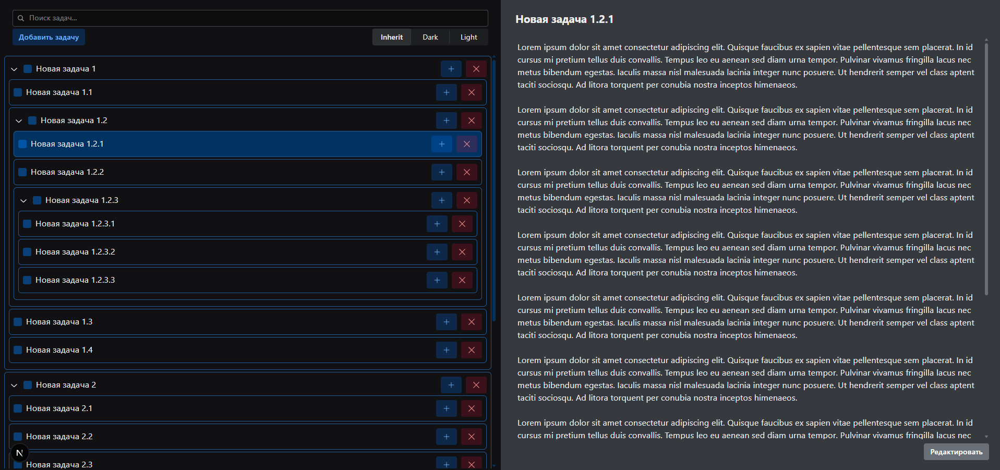

## How to start

First, run the development server:

```bash
# To install dependencies
npm install
# To run development server
npm run dev
# To run tests
npm run test
```

Open [http://localhost:3000](http://localhost:3000) with your browser to see the result.

## How it looks


